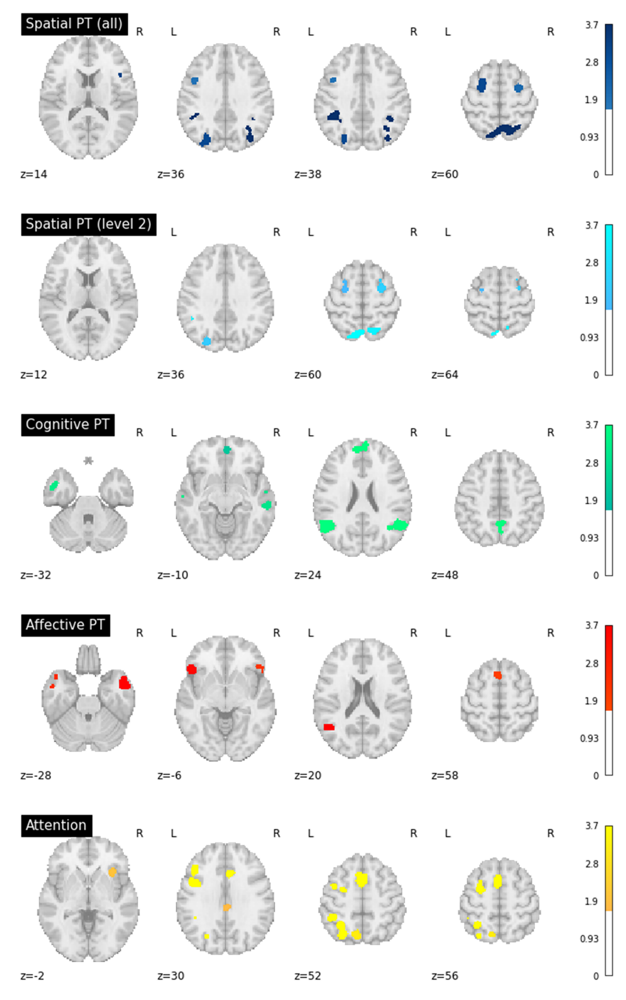

# ALE Meta-Analysis of Perspective Taking Using NiMARE

The following code will conudct a coordinate-based activation liklihood estimation (ALE) meta-analysis of neuroimaging studies of cognitive, affective, and spatial perspective taking and attention switching in NiMARE (Salo et al., 2021). Then, it will compute conjunctions between the images using nilearn (Abraham et al., 2014). 
  
 
**This analysis was conducted for a manuscript in-preperation:**
 
Brucato, M., Newcombe, N. S., & Chein, J. M., (in prep) A systematic ALE meta-analysis of spatial, cognitive, and affective perspective taking and dorsal attention. 
  
**Overview of Code Steps:**
1. Import modules, set parameters, and import data
2. Run individual ALE meta-analyses using NiMARE
3. Create cluster tables
4. Compute conjunctions using nilearn
 
The Jupyter Notebook ('CAS_PT_ALE_MetaAnalysis_NiMARE.ipynb') generates the following visualizations:

## Individual Domain ALE Maps

## Conjunction Maps

